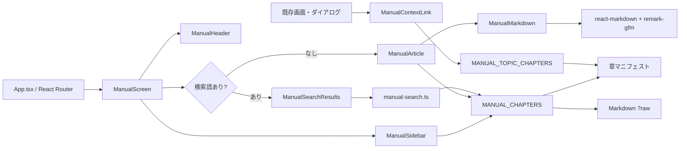

# 数学プリント作成ソフト マニュアル詳細設計書 v1.0

## 1. 文書情報

| 項目 | 内容 |
|---|---|
| 文書名 | 数学プリント作成ソフト マニュアル詳細設計書 |
| 文書版 | 1.0 |
| 基準日 | 2026-08-13 |
| 入力文書 | `マニュアル要件定義書.md` v1.0 |
| 関連文書 | `要件定義書.md`、`画面設計.md`、`詳細設計書.md` |
| 対象 | アプリ内マニュアル、検索、文脈リンク |
| 実装状態 | 未実装。本書は実装予定の内部設計を定義する |

本書は、`マニュアル要件定義書.md`を実装可能な粒度へ具体化する。既存アプリのReact、React Router、Vite、TypeScript、CSS、Vitest構成を維持し、プリント編集機能や永続データSchemaへ影響を与えずにマニュアル機能を追加する。

## 2. 設計上の確定事項

### 2.1 採用方式

| 項目 | 設計判断 |
|---|---|
| Markdown表示 | `react-markdown` |
| Markdown拡張 | `remark-gfm` |
| Markdown取得 | Viteの`?raw`インポートによるビルド時同梱 |
| 章管理 | TypeScriptの章マニフェストを正本とする |
| ルート | `/help`および`/help/:chapterSlug` |
| 検索 | 全章を対象としたブラウザ内の部分一致 |
| 検索結果UI | 検索中は本文領域を検索結果一覧へ切り替える |
| 文脈リンク | 原則として別タブで対象章を開く |
| 対応画面 | 横幅1024px以上のPC |
| マニュアル画像 | ローカル画像だけをViteのAssetとして同梱 |
| HTML | Markdown内の任意HTMLを無視する |
| 永続化 | 検索語、閲覧履歴、表示状態を保存しない |

### 2.2 採用しない方式

- MDX
- Docusaurus
- FlexSearchなどの検索ライブラリ
- `rehype-raw`
- CMSおよび外部ドキュメントAPI
- 見出しから生成する自動アンカー
- マニュアル本文のIndexedDB保存
- マニュアル専用の状態管理ライブラリ

### 2.3 設計原則

- 章情報は一度だけ定義し、ルート解決、目次、前後移動、検索、文脈リンク、文書検証で共有する。
- Markdown本文は表示内容に限定し、ルーティングやReactコードを含めない。
- マニュアル機能はWorksheet、Asset、Repository、Editor Storeへ依存しない。
- 外部通信がなくても表示できる構成にする。
- 現在の編集タブを変更せず、文脈リンクから説明を確認できるようにする。
- UIを追加する際は既存のボタン階層、色、フォーカス表示、64pxヘッダーを踏襲する。

## 3. 全体アーキテクチャ



### 3.1 レイヤー責務

| レイヤー | 責務 |
|---|---|
| `src/manual/` | 章メタデータ、Markdown本文、検索、文脈リンク対応、画像解決 |
| `src/presentation/manual/` | マニュアル画面と表示コンポーネント |
| `src/presentation/components/` | 既存画面から再利用する文脈リンクコンポーネント |
| `src/App.tsx` | マニュアルルートとアプリ必須APIゲート |
| `scripts/` | Markdown、slug、リンク、画像参照の静的検証 |

## 4. ファイル構成

実装時は次の構成を基本とする。

```text
src/
├─ manual/
│  ├─ manual-types.ts
│  ├─ manual-manifest.ts
│  ├─ manual-content.ts
│  ├─ manual-chapters.ts
│  ├─ manual-context.ts
│  ├─ manual-search.ts
│  ├─ manual-assets.ts
│  ├─ content/
│  │  ├─ overview.md
│  │  ├─ getting-started.md
│  │  ├─ worksheet-list.md
│  │  ├─ editor-basics.md
│  │  ├─ formulas.md
│  │  ├─ images-and-tables.md
│  │  ├─ answers.md
│  │  ├─ preview-and-pdf.md
│  │  ├─ saving-and-history.md
│  │  ├─ backup-and-trash.md
│  │  ├─ troubleshooting.md
│  │  └─ version-and-license.md
│  └─ assets/
│     └─ *.png | *.jpg | *.jpeg | *.webp
├─ presentation/
│  ├─ components/
│  │  └─ ManualContextLink.tsx
│  └─ manual/
│     ├─ ManualScreen.tsx
│     ├─ ManualHeader.tsx
│     ├─ ManualSidebar.tsx
│     ├─ ManualArticle.tsx
│     ├─ ManualMarkdown.tsx
│     ├─ ManualSearchResults.tsx
│     ├─ ManualNotFound.tsx
│     └─ ManualErrorBoundary.tsx
├─ App.tsx
└─ styles.css
scripts/
└─ verify-manual.ts
```

### 4.1 既存構成との差異

`マニュアル要件定義書.md`の構成例では表示コンポーネントも`src/manual/`へ置いていたが、本設計では既存アプリの責務分離に合わせて次のように分ける。

- コンテンツ、索引、検索などReactへ依存しない処理：`src/manual/`
- React画面および表示：`src/presentation/manual/`

Markdownファイル名、固定slug、ルート仕様は要件定義書を維持する。

## 5. 依存ライブラリ

### 5.1 追加パッケージ

```text
npm install react-markdown remark-gfm
```

- 実装時点でReact 19および既存Vite構成と互換性のある安定版を導入する。
- 正確な解決バージョンは`package-lock.json`へ固定する。
- Markdown表示のために`rehype-raw`、構文強調ライブラリ、YAML parserは追加しない。

### 5.2 既存パッケージの利用

- `react-router-dom`：章ルーティングとアプリ内リンク
- `lucide-react`：BookOpen、CircleHelp、Search、X、ChevronLeft、ChevronRight、ExternalLinkなど
- Vitest、Testing Library：単体およびUIテスト
- `tsx`：`scripts/verify-manual.ts`の実行

## 6. データモデル

### 6.1 基本型

`src/manual/manual-types.ts`へ次を定義する。

```ts
export type ManualChapterMetadata = {
  title: string;
  summary: string;
  keywords: readonly string[];
  updatedAt: string;
};

export type ManualChapterManifestItem = ManualChapterMetadata & {
  slug: string;
};

export type ManualMetadata = {
  manualVersion: string;
  targetAppVersion: string;
  updatedAt: string;
};
```

`manual-types.ts`は章マニフェストをimportしない。これにより、マニフェストからslug型を導出するときの循環参照を避ける。

`ManualChapterSlug`は手書きの別Unionにせず、章マニフェストの`as const`値から導出する。slug型を必要とする次の型は、それぞれslug導出後のファイルで定義する。

```ts
// manual-chapters.ts
export type ManualChapter = ManualChapterMetadata & {
  slug: ManualChapterSlug;
  order: number;
  markdown: string;
};

// manual-search.ts
export type ManualSearchResult = {
  slug: ManualChapterSlug;
  title: string;
  summary: string;
  excerpt: string;
  score: number;
  order: number;
};
```

### 6.2 マニュアル全体情報

`manual-manifest.ts`へ次を定義する。

```ts
export const MANUAL_METADATA = {
  manualVersion: "1.0",
  targetAppVersion: "1.0.0",
  licenseName: "個人・非商用ソフトウェアライセンス",
  licenseVersion: "1.0",
  copyright: "Copyright © 2026 Yamahara Yoshihiro",
  licenseContact: "yoshihiro@yamahara.email",
  updatedAt: "2026-08-22",
} as const satisfies ManualMetadata;
```

- `manualVersion`はマニュアル構成または内容の版を示す。
- `targetAppVersion`は説明対象の`package.json`版を示す。
- アプリ版変更時に自動追従させず、内容確認後に意図的に更新する。

### 6.3 章マニフェスト

章マニフェストは表示順を持つ配列とし、配列順を章順の正本とする。

```ts
export const MANUAL_CHAPTER_MANIFEST = [
  {
    slug: "overview",
    title: "はじめに・動作環境",
    summary: "保存場所と動作環境など、利用前に確認する内容です。",
    keywords: ["はじめに", "動作環境", "ブラウザ", "保存先", "クラウド"],
    updatedAt: "2026-08-13",
  },
  // 残り11章
] as const satisfies readonly ManualChapterManifestItem[];

export type ManualChapterSlug =
  (typeof MANUAL_CHAPTER_MANIFEST)[number]["slug"];
```

マニフェストには次の12slugを順番どおりに登録する。

```text
overview
getting-started
worksheet-list
editor-basics
formulas
images-and-tables
answers
preview-and-pdf
saving-and-history
backup-and-trash
troubleshooting
version-and-license
```

### 6.4 値の制約

- `slug`：`^[a-z][a-z0-9-]*$`
- `title`：空白だけを禁止し、画面上の章名として使用する
- `summary`：検索結果で単独表示して意味が通る1～2文
- `keywords`：UI文言、略称、表記ゆれを含む。重複と空文字を禁止する
- `updatedAt`：`YYYY-MM-DD`
- 章順：配列index＋1を`order`として導出し、手入力しない

## 7. Markdown本文の読込み

### 7.1 明示的raw import

`manual-content.ts`で各Markdownを明示的に読み込む。

```ts
import overview from "./content/overview.md?raw";
import gettingStarted from "./content/getting-started.md?raw";
// 残り10章

export const MANUAL_CONTENT = {
  overview,
  "getting-started": gettingStarted,
  // 残り10章
} satisfies Record<ManualChapterSlug, string>;
```

`import.meta.glob()`でファイル名から章を暗黙生成せず、TypeScriptが全slugの本文有無と余剰キーを検査できる形にする。

### 7.2 章レジストリ

`manual-chapters.ts`でマニフェストと本文を結合する。

```ts
export const MANUAL_CHAPTERS: readonly ManualChapter[] =
  MANUAL_CHAPTER_MANIFEST.map((metadata, index) => ({
    ...metadata,
    order: index + 1,
    markdown: MANUAL_CONTENT[metadata.slug],
  }));

export const MANUAL_CHAPTER_BY_SLUG = new Map(
  MANUAL_CHAPTERS.map((chapter) => [chapter.slug, chapter]),
);
```

次のselectorを同ファイルから公開する。

```ts
getManualChapter(slug: string): ManualChapter | undefined
getAdjacentManualChapters(slug: ManualChapterSlug): {
  previous?: ManualChapter;
  next?: ManualChapter;
}
isManualChapterSlug(value: string): value is ManualChapterSlug
```

`exactOptionalPropertyTypes`に対応するため、前章または次章がない場合はプロパティへ`undefined`を代入せず、プロパティ自体を省略する。

### 7.3 Markdown執筆規約

- ファイル内に`h1`を置かない。章題名はReact側が1つだけ表示する。
- 本文の最上位見出しは`##`とする。
- 見出し階層を飛ばさない。
- UI文言は「」で囲み、実装上の表示と一致させる。
- 連続操作は番号付きリストにする。
- Markdown内へ`<div>`、`<script>`、JSXなどのHTMLを記述しない。
- 章間リンクは`/help/<固定slug>`形式とする。
- マニュアル画像は`manual-assets/<ファイル名>`形式で参照する。
- 意味を持つ画像のaltを空にしない。
- Markdown内へ外部画像URLを記述しない。

## 8. ルーティング設計

### 8.1 Appルート構成

現在の`App`は必須ブラウザAPI判定をRouterより前で行う。本実装では、マニュアルがプリント用APIに依存しないことを保証するため、API判定をアプリ機能ルートだけへ適用する。

```tsx
<BrowserRouter>
  <Routes>
    <Route path="/help" element={<Navigate to="/help/overview" replace />} />
    <Route
      path="/help/:chapterSlug"
      element={<ManualErrorBoundary><ManualScreen /></ManualErrorBoundary>}
    />
    <Route
      path="/help/*"
      element={<ManualErrorBoundary><ManualScreen /></ManualErrorBoundary>}
    />

    <Route element={<RequiredApiGate />}>
      <Route path="/" element={<WorksheetListScreen />} />
      <Route path="/worksheets/:worksheetId" element={<EditorScreen />} />
      <Route path="/trash" element={<TrashScreen />} />
      <Route path="*" element={<Navigate to="/" replace />} />
    </Route>
  </Routes>
</BrowserRouter>
```

`RequiredApiGate`は既存`supportsRequiredApis()`を呼び、不成立なら現在の非対応画面を表示し、成立なら`<Outlet />`を返す。

### 8.2 ルート別動作

| URL | 動作 |
|---|---|
| `/help` | `replace`で`/help/overview`へ移動 |
| `/help/overview` | 先頭章を表示 |
| `/help/<有効slug>` | 対応章を表示 |
| `/help/<無効slug>` | マニュアルレイアウト内Not Found |
| `/help/a/b` | マニュアルレイアウト内Not Found |
| その他の不正URL | 既存どおり`/`へ移動 |

### 8.3 SPA配信

`/help/:chapterSlug`へ直接アクセスしても`index.html`を返す必要がある。この条件は既存の`/worksheets/:worksheetId`と同じであり、配信環境のSPA fallback設定を利用する。

## 9. コンポーネント設計

### 9.1 コンポーネントツリー

```text
ManualErrorBoundary
└─ ManualScreen
   ├─ ManualHeader
   │  ├─ ブランド／画面名
   │  ├─ 検索欄
   │  └─ アプリへ移動
   ├─ ManualSmallScreenWarning
   └─ ManualWorkspace
      ├─ ManualSidebar
      └─ main
         ├─ ManualSearchResults  検索語あり
         ├─ ManualArticle        有効章
         │  ├─ 章ヘッダー
         │  ├─ ManualMarkdown
         │  └─ 前章・次章
         └─ ManualNotFound       不明slugまたは不明URL
```

### 9.2 ManualScreen

責務は次のとおり。

- `useParams()`から`chapterSlug`を取得する
- `getManualChapter()`で章を解決する
- 検索入力stateを保持する
- 正規化後の検索語が空かどうかで本文と検索結果を切り替える
- 検索結果選択時に対象章へ移動し、検索語を空にする
- 章変更時のスクロールとフォーカスを制御する

```ts
type ManualScreenState = {
  query: string;
};
```

検索語はURL、LocalStorage、SessionStorageへ保存しない。再読み込み時は空へ戻す。

### 9.3 ManualHeader

```ts
type ManualHeaderProps = {
  query: string;
  resultCount: number | null;
  onQueryChange: (value: string) => void;
  onClearQuery: () => void;
};
```

- ブランドボタンは`/`へ移動する。
- 画面名として「使い方」を表示する。
- 検索欄の`aria-label`は「マニュアルを検索」とする。
- placeholderは「使い方を検索」とする。
- 入力がある場合だけクリアボタンを表示する。
- Escapeで検索を解除し、検索欄へフォーカスを維持する。
- 検索件数は本文側の`role="status"`で通知し、入力のたびにヘッダーで重複通知しない。
- 「アプリへ戻る」は通常の同一タブリンクとする。別タブで開かれたマニュアルから元のタブを特定または閉じる処理は行わない。

### 9.4 ManualSidebar

```ts
type ManualSidebarProps = {
  currentSlug?: ManualChapterSlug;
  searchActive: boolean;
};
```

- `nav aria-label="マニュアル目次"`とする。
- `MANUAL_CHAPTERS`を定義順に表示する。
- 有効章のリンクへ`aria-current="page"`を付ける。
- 検索中も現在URLに対応する章は選択状態を維持する。
- 章リンク選択時は検索を解除するため、`ManualScreen`からcallbackを渡す。
- 目次項目は章番号と題名を表示する。

`exactOptionalPropertyTypes`に対応するため、Not Found時は`currentSlug`を渡さない。

### 9.5 ManualArticle

```ts
type ManualArticleProps = {
  chapter: ManualChapter;
  previous?: ManualChapter;
  next?: ManualChapter;
};
```

- `article`をルートとする。
- React側で章題名を`h1`として表示する。
- 概要を章題名直下へ表示する。
- `ManualMarkdown`へ本文を渡す。
- 版情報とライセンスは、目次の最終章`version-and-license`のMarkdown本文へまとめて表示する。
- 前章、次章リンクには移動先題名を含める。
- 前章または次章がない場合は空の無効ボタンを置かず、該当リンクを描画しない。

### 9.6 ManualNotFound

- `ManualNotFound.tsx`は本文領域へ表示する`ManualNotFound`をexportする。
- `ManualScreen`で1階層の不明slugまたは`/help/*`に一致した不明URLを検出した場合に使用する。
- ヘッダー、検索state、PC幅警告、目次は`ManualScreen`が通常章と同じように組み立てる。
- 見出し「マニュアルのページが見つかりません」を表示する。
- 入力URLを本文へそのままHTMLとして挿入しない。
- 「はじめにを見る」と章目次を提供する。
- アプリ全体のNot Foundと混同せず、マニュアルヘッダーと目次を維持する。

### 9.7 ManualErrorBoundary

raw importはビルド時に解決されるため、本文ファイル欠落はビルドエラーとする。実行時のReact描画例外だけをError Boundaryで捕捉する。

- 見出し「マニュアルを表示できませんでした」
- 再読み込みボタン
- 「はじめに」への通常リンク
- 技術的な例外本文やスタックを利用者へ表示しない

## 10. 画面レイアウト

### 10.1 基準ワイヤーフレーム

```text
┌──────────────────────────────────────────────────────────────────────────────┐
│ Σ 数学プリント作成  使い方     [🔍 使い方を検索____________] [アプリへ戻る] │ 64px
├──────────────────────────────────────────────────────────────────────────────┤
│                                                                              │
│ ┌──────────── 240px ───────────┐  ┌──────── 本文 最大820px ──────────────┐ │
│ │ マニュアル目次               │  │ はじめに・動作環境                  │ │
│ │ 1 はじめに・動作環境         │  │ 章の概要                             │ │
│ │ 2 最初のプリントを作る       │  │                                      │ │
│ │ 3 プリント一覧               │  │ ## 本文見出し                        │ │
│ │ 4 編集の基本                 │  │ 説明本文                             │ │
│ │ …                            │  │                                      │ │
│ │ 11 トラブル対応              │  │ [前の章]                  [次の章]   │ │
│ └──────────────────────────────┘  └──────────────────────────────────────┘ │
│                                                                              │
└──────────────────────────────────────────────────────────────────────────────┘
```

### 10.2 寸法

| 要素 | 設計値 |
|---|---:|
| ヘッダー高 | 64px |
| 全体最大幅 | 1216px |
| 左右padding | 48px。1024～1280pxでは32px |
| 目次幅 | 240px |
| 目次と本文の間隔 | 40px |
| 本文最大幅 | 820px |
| 本文上padding | 40px |
| 本文下padding | 72px |
| 本文標準行高 | 1.8 |

画面中央のGridは`240px minmax(0, 820px)`とし、余剰幅は本文外の余白へ配分する。本文幅を無制限に拡大しない。

### 10.3 固定表示

- ヘッダーは`position: sticky; top: 0; z-index`を持つ。
- 目次は`position: sticky; top: 88px`とする。
- 目次の最大高は`calc(100vh - 112px)`とし、超過時は目次内部だけを縦スクロールする。
- 本文はページ全体の縦スクロールを使用する。

### 10.4 検索結果表示

検索語が1文字以上ある間、右の本文領域を次へ切り替える。

```text
┌──────────────────────────────────────────────────────────┐
│ 「バックアップ」の検索結果                               │
│ 3件見つかりました                                        │
│                                                          │
│ ┌ バックアップとゴミ箱 ───────────────────────────────┐ │
│ │ JSONファイルへすべてのプリントを…                    │ │
│ └──────────────────────────────────────────────────────┘ │
│ ┌ はじめに・動作環境 ─────────────────────────────────┐ │
│ │ ブラウザ内へ保存されるため定期的に…                  │ │
│ └──────────────────────────────────────────────────────┘ │
└──────────────────────────────────────────────────────────┘
```

- 左目次を維持する。
- 検索結果中は前章・次章を表示しない。
- 結果選択で対象章へ移動し、検索を解除する。
- 結果0件では検索語と「検索をクリア」を表示する。

## 11. 章切り替えとフォーカス

### 11.1 章リンク

- 目次、検索結果、前章・次章はReact Routerの`Link`を使用する。
- 章移動は同じマニュアルタブ内で行う。
- ブラウザ履歴へ章移動を積み、戻る、進むを利用できるようにする。

### 11.2 スクロール

章slug変更時に次を行う。

1. 章`h1`へプログラム上のフォーカスを移す。
2. `window.scrollTo({ top: 0 })`で本文先頭へ戻す。

`h1`には`tabIndex={-1}`を付ける。検索入力中はキー入力のたびにフォーカスを移動しない。

### 11.3 検索結果選択

検索結果選択時の順序は次とする。

1. `navigate("/help/<slug>")`
2. 検索stateを空にする
3. ルート更新後のeffectで章`h1`へフォーカスする
4. ページ先頭へ戻す

## 12. Markdownレンダリング

### 12.1 基本設定

```tsx
<ReactMarkdown
  remarkPlugins={[remarkGfm]}
  skipHtml
  urlTransform={transformManualUrl}
  components={manualMarkdownComponents}
  remarkRehypeOptions={{
    footnoteLabel: "脚注",
    footnoteBackLabel: "本文へ戻る",
  }}
>
  {markdown}
</ReactMarkdown>
```

- `skipHtml`を必須とする。
- `rehype-raw`を追加しない。
- 見出しIDを付ける`rehype-slug`を追加しない。
- 任意プラグインを追加する場合は、出力要素とURLへの影響をセキュリティ観点で確認する。

### 12.2 要素マッピング

| Markdown要素 | React表示 |
|---|---|
| `a` | `ManualLink` |
| `p` | `ManualParagraph` |
| `img` | `ManualImage` |
| `table` | 横スクロール用`div`＋`table` |
| `blockquote` | `ManualCallout` |
| `pre` | スクロール可能なコード領域 |
| `code` | インラインまたはブロック用クラス |
| `h2`～`h6` | 既存の見出し書体と間隔を適用 |

### 12.3 リンク判定

`ManualLink`は`href`を次の順で判定する。

1. `/help`または`/help/`で始まる：React Router `Link`
2. `/`で始まり`//`で始まらない：アプリ内`Link`
3. `https://`または`http://`：外部`a`
4. その他：リンクとして描画せず、子テキストだけを表示

外部リンクには必ず次を付ける。

```tsx
target="_blank"
rel="noopener noreferrer"
```

`javascript:`、`data:`、`file:`、protocol-relative URL、未知のschemeは拒否する。

### 12.4 URL変換

`transformManualUrl(url, key)`は`href`と`src`を区別する。

- `href`：12.3の許可ルールだけを通す
- `src`：`manual-assets/<安全なファイル名>`だけを通す
- 不許可URL：空文字を返す

ファイル名は`/`、`\`、`..`を含めず、`[A-Za-z0-9._-]+`へ限定する。

### 12.5 注意、重要、ヒント

Markdownは次の書式を使用する。

```md
> **重要**
>
> ブラウザのデータを削除すると、保存したプリントを失う可能性があります。
```

`ManualCallout`はblockquoteの先頭テキストを判定する。

| ラベル | class | 用途 |
|---|---|---|
| `重要` | `manual-callout-important` | データ消失や不可逆操作 |
| `注意` | `manual-callout-warning` | 制約や失敗しやすい操作 |
| `ヒント` | `manual-callout-tip` | 操作を簡単にする情報 |
| その他 | `manual-callout-default` | 通常の引用 |

ラベル文字列はDOMへ残し、色だけで種類を示さない。

### 12.6 画像とキャプション

画像だけを含む段落は`ManualParagraph`が`figure`へ変換する。

```md

```

- altを画像の代替テキストとfigcaptionに使用する。
- 装飾画像では空altを許すが、figcaptionを表示しない。
- 画像とテキストが同じ段落にある場合は通常段落として描画する。
- 画像読込み失敗時は代替テキストを表示する。

### 12.7 表

- `table`を`div.manual-table-scroll`で囲む。
- `overflow-x: auto`を表ラッパーへ設定する。
- `th`と`td`へ既存の境界色を使用する。
- GFMのalignmentを尊重する。
- 横スクロールはページ全体へ伝播させない。

## 13. マニュアル画像

### 13.1 Asset解決

`manual-assets.ts`は次のglobを使用する。

```ts
const assetModules = import.meta.glob(
  "./assets/*.{png,jpg,jpeg,webp}",
  { eager: true, query: "?url", import: "default" },
) as Record<string, string>;
```

globのキーからファイル名だけを取り出し、次のMapを構築する。

```ts
ReadonlyMap<string, string> // manual-assets/foo.png -> Vite生成URL
```

### 13.2 解決関数

```ts
resolveManualAsset(source: string): string | undefined
```

- `manual-assets/`接頭辞を必須とする。
- ファイル名検証後にMapを参照する。
- 存在しない場合は`undefined`を返す。
- 外部URLおよび任意の相対パスを解決しない。

### 13.3 画像更新方針

- UIの全状態を網羅する画像集は作成しない。
- 画像は画面配置や見つけにくい操作の説明へ限定する。
- 画像へ文字を焼き込む場合も、本文で同じ情報を説明する。
- UI変更時は`verify-manual.ts`で欠落だけを検出し、内容の古さはレビューで確認する。

## 14. 検索設計

### 14.1 事前生成データ

`manual-search.ts`のモジュール初期化時に各章から次を生成する。

```ts
type SearchableManualChapter = {
  chapter: ManualChapter;
  normalizedTitle: string;
  normalizedSummary: string;
  normalizedKeywords: readonly string[];
  plainTextBlocks: readonly string[];
  normalizedBody: string;
};
```

12章程度を前提とするため、Worker、永続index、非同期初期化は使用しない。

### 14.2 Markdownから検索文への変換

`markdownToPlainTextBlocks(markdown)`は次の順で処理する。

1. CRLFをLFへ統一する。
2. fenced codeの開始・終了記号と言語名を除去し、画面に表示されるコード本文は残す。
3. 画像をaltテキストへ置換し、画像パスを除去する。
4. リンクをラベルへ置換し、URLを除去する。
5. 見出し、引用、リスト、強調、コードのMarkdown記号を除去する。
6. GFM表の区切り行を除去し、セル本文を空白で連結する。
7. HTMLらしいタグ文字列を除去する。
8. 空行で表示上の段落blockへ分割する。
9. 連続空白を1つへまとめ、空blockを捨てる。

検索用変換は表示処理ではないため、完全なMarkdown parserを新規追加しない。表示本文と大きく異なるケースは`manual-search.test.ts`へ例を追加する。

### 14.3 文字列正規化

`normalizeManualSearchText(value)`は次を行う。

1. `normalize("NFC")`
2. 全角空白U+3000を半角空白へ変換
3. 全角ASCII U+FF01～U+FF5Eを半角へ変換
4. `toLocaleLowerCase("ja-JP")`
5. 連続空白を1つへまとめる
6. 前後空白を除去

ひらがな、カタカナ、漢字、長音、送り仮名の変換は行わない。

### 14.4 Query分割

```ts
const normalizedQuery = normalizeManualSearchText(query);
const tokens = [...new Set(normalizedQuery.split(" ").filter(Boolean))];
```

- 重複語を除去する。
- tokenが0件なら検索を実行しない。
- すべてのtokenが、題名、概要、キーワード、本文のいずれかに存在する章だけを結果に含める。

### 14.5 Score

一致章へ次を加点する。

| 条件 | 点数 |
|---|---:|
| 正規化した題名がquery全体と完全一致 | 500 |
| 題名がquery全体を含む | 300 |
| 題名がtokenを含む | tokenごとに100 |
| キーワードがtokenを含む | tokenごとに60 |
| 概要がtokenを含む | tokenごとに30 |
| 本文がtokenを含む | tokenごとに10 |

同じtokenが同じfieldへ複数回現れても、fieldごとの加点は1回とする。結果は次でsortする。

1. `score`降順
2. `order`昇順

### 14.6 抜粋

`createManualExcerpt()`は次で表示文を選ぶ。

1. normalized blockが最も多くのtokenを含む本文block
2. 同数なら先に現れるblock
3. 本文に一致blockがなければ章概要

表示は120文字を上限とし、前後を切った場合は`…`を付ける。HTML文字列は生成せず、Reactの通常テキストとして描画する。初期リリースでは一致語の`mark`強調を行わない。

### 14.7 公開関数

```ts
searchManual(query: string): readonly ManualSearchResult[]
normalizeManualSearchText(value: string): string
markdownToPlainTextBlocks(markdown: string): readonly string[]
```

### 14.8 React側の計算

```ts
const deferredQuery = useDeferredValue(query);
const results = useMemo(
  () => searchManual(deferredQuery),
  [deferredQuery],
);
```

検索規模は小さいが、入力応答を優先するため`useDeferredValue`を使用する。setTimeoutによるdebounceは使用しない。

## 15. 文脈リンク設計

### 15.1 Topic型

画面がslug文字列を直接持たないよう、利用場面を表すTopicを定義する。

```ts
export type ManualTopic =
  | "overview"
  | "editorBasics"
  | "worksheetSettings"
  | "pdf"
  | "formula"
  | "image"
  | "table"
  | "answers"
  | "saving"
  | "backup"
  | "trash"
  | "troubleshooting";

export const MANUAL_TOPIC_CHAPTERS = {
  overview: "overview",
  editorBasics: "editor-basics",
  worksheetSettings: "preview-and-pdf",
  pdf: "preview-and-pdf",
  formula: "formulas",
  image: "images-and-tables",
  table: "images-and-tables",
  answers: "answers",
  saving: "saving-and-history",
  backup: "backup-and-trash",
  trash: "backup-and-trash",
  troubleshooting: "troubleshooting",
} as const satisfies Record<ManualTopic, ManualChapterSlug>;
```

### 15.2 ManualContextLink

```ts
type ManualContextLinkProps = {
  topic: ManualTopic;
  children?: React.ReactNode;
  variant?: "text" | "icon";
  className?: string;
};
```

- `topic`からslugを解決する。
- `href="/help/<slug>"`を生成する。
- `target="_blank"`、`rel="noopener noreferrer"`を必ず付ける。
- `variant="icon"`ではCircleHelpを表示し、`aria-label`と`title`を付ける。
- `variant="text"`ではchildrenを表示し、未指定時は「詳しい使い方」を使用する。
- click handlerでダイアログを閉じたり、保存や画面遷移を実行しない。
- React Router `Link`は使用しない。別タブを確実に開く通常の`a`要素とする。

### 15.3 配置設計

| 既存ファイル／領域 | Topic | 表示 |
|---|---|---|
| `WorksheetListScreen.tsx`のヘッダー | `overview` | BookOpen付き「使い方」 |
| `EditorScreen.tsx`のヘッダー | `editorBasics` | CircleHelpのアイコンボタン |
| `BackupModal` | `backup` | データ説明付近のテキストリンク |
| `ImportModal` | `backup` | 注意説明の後のテキストリンク |
| `WorksheetSettingsDialog` | `worksheetSettings` | ダイアログ本文末尾のテキストリンク |
| `PdfDialog` | `pdf` | 出力説明付近のテキストリンク |
| `MathDialog` | `formula` | `dialog-lead`付近のテキストリンク |
| `ImageDialog` | `image` | ファイル制限説明付近のテキストリンク |
| `TableDialog` | `table` | `dialog-lead`付近のテキストリンク |
| `TrashScreen.tsx`の案内領域 | `trash` | 「ゴミ箱について」 |

編集ヘッダーは既に操作が多いため、文字付き「使い方」は追加せず、PDF出力の前またはプリント設定の前へアイコンだけを置く。

### 15.4 ダイアログ内配置

- Modal footerの主要操作列へヘルプを混在させない。
- 文脈リンクは`modal-body`内の説明領域へ置く。
- リンク選択時もModalは開いたままとする。
- 元タブへ戻ったとき、入力値とフォーカス可能状態を維持する。

## 16. PC幅制御

### 16.1 DOM構成

ManualScreenは通常画面と幅警告を両方描画し、CSSで排他的に表示する。

```tsx
<div className="manual-shell">
  <ManualHeader />
  <div className="manual-workspace">...</div>
  <main className="manual-width-warning">...</main>
</div>
```

### 16.2 CSS breakpoint

```css
.manual-width-warning { display: none; }

@media (max-width: 1023px) {
  .manual-workspace,
  .manual-header-tools { display: none; }
  .manual-width-warning { display: flex; }
}
```

- 1024pxでは通常マニュアルを表示する。
- 1023px以下では目次、検索、本文を`display: none`にする。
- 警告見出しは「PCサイズの画面で開いてください」とする。
- スマートフォン用目次や本文へ切り替える処理は実装しない。

## 17. アクセシビリティ設計

### 17.1 Landmark

- ヘッダー：`header`
- 目次：`nav aria-label="マニュアル目次"`
- 本文または検索結果：`main id="manual-main"`
- 章本文：`article`
- 前章・次章：`nav aria-label="前後の章"`

### 17.2 Skip link

マニュアル画面先頭に「本文へ移動」skip linkを置き、`#manual-main`へ移動できるようにする。通常時は画面外、focus時は表示する。

見出し単位の共有アンカーは提供しないが、アクセシビリティ用の固定`id="manual-main"`は使用する。

### 17.3 Focus

- すべてのリンクと検索欄に既存のfocus ringを適用する。
- 章切り替え後は章`h1`へfocusする。
- 検索結果件数は`role="status" aria-live="polite"`とする。
- 検索結果0件は同じstatus領域で通知する。
- 文脈リンクのアイコンだけ表示には具体的な`aria-label`を付ける。

### 17.4 色と動き

- 現在章、注意種別、外部リンクを色だけで区別しない。
- hoverだけに依存する操作を設けない。
- スクロールは原則instantとし、不要なアニメーションを追加しない。
- 将来smooth scrollを追加する場合は`prefers-reduced-motion`で無効化する。

## 18. セキュリティとプライバシー

### 18.1 Markdown

- `skipHtml`を常に有効化する。
- `dangerouslySetInnerHTML`を使用しない。
- `rehype-raw`を追加しない。
- buildに同梱したMarkdown以外を表示入力として受け付けない。
- URL変換とリンクコンポーネントの双方でschemeを確認する。

### 18.2 外部通信

- マニュアル画像を外部URLから取得しない。
- 外部フォント、解析script、検索APIを使用しない。
- 外部リンクは利用者の明示操作時だけ新しいタブで開く。
- 検索語、現在章、リンク選択を送信しない。

### 18.3 アプリデータ分離

`src/manual/`および`src/presentation/manual/`から次をimportしない。

- `database.ts`
- `worksheetRepository`
- `editor-store.ts`
- backup処理
- PDF生成処理
- WorksheetおよびAssetの実データ

マニュアル内でデータ例が必要な場合は固定の説明用文字列またはローカル画像を使用する。

## 19. エラー処理

| 場面 | 検出時期 | 処理 |
|---|---|---|
| Markdownファイル欠落 | build／manual:check | build失敗。実行時へ進めない |
| slug重複 | manual:check／test | 検証失敗 |
| 本文が空 | manual:check | 検証失敗 |
| 内部リンク先なし | manual:check | 検証失敗 |
| 画像参照先なし | manual:check | 検証失敗 |
| 無効章URL | 実行時 | ManualNotFound |
| 画像読込み失敗 | 実行時 | altを含む欠落表示 |
| React描画例外 | 実行時 | ManualErrorBoundary |
| 検索結果なし | 実行時 | 0件状態とクリア操作 |

検索処理は純粋関数とし、1章の不正データで例外を投げない。静的検証を通っていない不正値は空文字へ補正せず、開発時に失敗させる。

## 20. スタイル設計

### 20.1 class namespace

既存`src/styles.css`へ追加し、すべて`manual-`接頭辞を付ける。

```text
manual-shell
manual-header
manual-header-tools
manual-search
manual-workspace
manual-sidebar
manual-toc
manual-main
manual-article
manual-summary
manual-content
manual-table-scroll
manual-callout-*
manual-figure
manual-chapter-nav
manual-search-results
manual-search-result
manual-not-found
manual-width-warning
```

既存の`.primary-button`、`.secondary-button`、`.icon-button`、`.brand`など、意味と寸法が一致するclassは再利用する。

### 20.2 色

- 背景：`var(--color-surface)`または白
- 境界：`var(--color-line)`
- 本文：既存本文色
- 補足：`var(--color-muted)`
- リンクと現在章：`var(--color-primary)`系
- 重要：危険色系だが、削除ボタンと同じ塗りつぶしにはしない
- 注意：黄系の淡色背景
- ヒント：主色の淡色背景

### 20.3 Typography

- `h1`：28px、既存heading font
- `h2`：21px
- `h3`：17px
- 本文：14px、line-height 1.8
- 目次：13px
- 補足および版情報：12px
- code：既存OS monospace stack

### 20.4 印刷

初期リリースでは専用印刷レイアウトを作らない。ブラウザ印刷で最低限本文が表示されることは妨げないが、印刷結果を受け入れ対象に含めない。

## 21. 文書検証スクリプト

### 21.1 verify-manual.ts

Nodeの`fs`、`path`と既存`tsx`だけで実装し、次を検査する。

1. 12章のslugが一意で正規表現に適合する。
2. マニフェストの各slugに同名Markdownがある。
3. `content/`にマニフェスト未登録Markdownがない。
4. Markdownが空でない。
5. Markdownに`# `のh1がない。
6. 見出し階層が一度に2段階以上深くならない。
7. `/help/<slug>`リンク先が存在する。
8. `manual-assets/<file>`参照先が存在する。
9. 外部画像URLがない。
10. 画像altが空の場合は装飾用であることを明示する規約に適合する。
11. `<script>`、JSX、明らかな生HTMLタグがない。
12. MANUAL_TOPIC_CHAPTERSの移動先が有効slugである。

HTMLらしい記述の検査は誤検知を避けるため、禁止タグ一覧と開始タグpatternを使用する。数式の不等号や説明上の`<`、`>`だけでは失敗させない。

### 21.2 npm script

```json
{
  "scripts": {
    "manual:check": "tsx scripts/verify-manual.ts",
    "verify": "npm run typecheck && npm run schema:check && npm run schema:test && npm run manual:check && npm run test"
  }
}
```

`manual:check`はファイルを変更せず、異常時だけ非0で終了する。

## 22. テスト設計

### 22.1 テストファイル

| テストファイル | 主な対象 |
|---|---|
| `src/manual/manual-chapters.test.ts` | slug、順序、selector、前後章 |
| `src/manual/manual-search.test.ts` | 平文化、正規化、AND検索、Score、抜粋 |
| `src/manual/manual-context.test.ts` | Topicから有効slugへの対応 |
| `src/presentation/manual/ManualMarkdown.test.tsx` | GFM、HTML無視、リンク、画像、表、callout |
| `src/presentation/manual/ManualScreen.test.tsx` | ルート、目次、検索、Not Found、前後移動 |
| `src/presentation/components/ManualContextLink.test.tsx` | href、target、rel、aria-label |
| 既存各画面テスト | 文脈リンクの配置と移動先 |

### 22.2 manual-chapters.test.ts

- 全12章が定義順に存在する。
- slugが重複しない。
- `getManualChapter()`が有効slugだけを返す。
- 先頭章にpreviousがない。
- 最終章にnextがない。
- 中間章のpreviousとnextが正しい。
- 本文が空でない。

### 22.3 manual-search.test.ts

- NFC正規化
- 全角ASCII、全角空白の変換
- 英字の小文字化
- 複数空白の圧縮
- 画像URLを検索対象にしない
- リンクURLを検索対象にしない
- 表セル本文を検索できる
- 題名、キーワード、概要、本文を検索できる
- 複数語はANDになる
- 重複語でScoreが重複加点されない
- 題名一致が本文一致より先になる
- 同Scoreでは章順になる
- 抜粋が120文字以内である
- 空検索で結果を返さない

### 22.4 ManualMarkdown.test.tsx

- GFM表を表示する。
- task listと脚注を表示する。
- HTML文字列を要素として描画しない。
- `javascript:`リンクを生成しない。
- 外部リンクへ`target`と`rel`を付ける。
- マニュアル内リンクをReact Routerで移動できる。
- 画像だけの段落をfigureとcaptionへ変換する。
- 存在しない画像を欠落表示にする。
- 重要、注意、ヒントのラベルとclassを表示する。

### 22.5 ManualScreen.test.tsx

- `/help/overview`で章題名、目次、本文を表示する。
- 現在章に`aria-current="page"`を付ける。
- 目次選択で章を切り替える。
- 前章、次章で移動する。
- 検索入力時に本文を検索結果へ切り替える。
- 検索結果件数をstatusとして表示する。
- 結果選択で検索を解除し、章へ移動する。
- Escapeとクリアボタンで検索を解除する。
- 0件状態を表示する。
- 不明slugでManualNotFoundを表示する。

### 22.6 既存画面テストへの追加

- `WorksheetListScreen.test.tsx`：「使い方」のhrefと別タブ属性
- `EditorScreen`関連テスト：ヘルプアイコンのhrefとaria-label
- `EditorDialogs.test.tsx`：各ダイアログのTopicリンク
- `TrashScreen`関連テスト：「ゴミ箱について」のhref

文脈リンク選択による実ブラウザのタブ生成はjsdomで検証せず、`target="_blank"`と元画面stateを変更するhandlerがないことを検証する。

### 22.7 画面幅の確認

jsdomはCSS media queryの表示結果を保証しないため、次を分ける。

- UIテスト：通常領域と幅警告へ意図したclassが付くこと
- CSSレビュー：`max-width: 1023px`の排他的表示
- 実ブラウザ確認：1023pxで警告、1024pxで通常画面

## 23. ビルドと検証

### 23.1 TypeScript

既存の次の設定へ適合する。

- `strict`
- `noUncheckedIndexedAccess`
- `exactOptionalPropertyTypes`
- `moduleResolution: Bundler`
- `vite/client`型

`.md?raw`と`import.meta.glob`はViteの型を利用し、独自のワイルドカードmodule declarationは原則追加しない。

### 23.2 build

```text
npm run build
├─ tsc --noEmit
└─ vite build
   ├─ Markdown本文をJS Assetへ同梱
   └─ マニュアル画像をhash付きAssetへ出力
```

### 23.3 verify

```text
npm run verify
├─ npm run typecheck
├─ npm run schema:check
├─ npm run schema:test
├─ npm run manual:check
└─ npm run test
```

マニュアル追加はWorksheet Schemaへ影響しないため、Schema生成物は変更しない。

## 24. 要件トレーサビリティ

| マニュアル要件定義書 | 主な詳細設計 | 主な検証 |
|---|---|---|
| 3 対象環境・PC専用 | 8、10、16 | ManualScreen、実ブラウザ幅確認 |
| 4 対象範囲 | 2、4、5 | package差分、完了条件 |
| 5 技術構成 | 4、5、7、12 | build、依存確認 |
| 6 ルーティング | 8、11 | ManualScreen test |
| 7 マニュアル画面 | 9、10、11 | ManualScreen test |
| 8 Markdown表示 | 12、13 | ManualMarkdown test、manual:check |
| 9 検索 | 10.4、14 | manual-search test |
| 10 文脈リンク | 15 | ContextLink test、既存画面test |
| 11 章立て | 6、7 | manual-chapters test、manual:check |
| 12 コンテンツ作成 | 7.3、21 | manual:check、レビュー |
| 13 セキュリティ | 12、13、18 | ManualMarkdown test |
| 14 アクセシビリティ | 9～12、17 | Testing Library、手動確認 |
| 15 性能・オフライン | 7、13、14 | build Asset確認、Network確認 |
| 16 エラー・空状態 | 9.6、9.7、19 | UI test |
| 17 テスト要件 | 21～23 | manual:check、Vitest |
| 18 受け入れ条件 | 全節 | 25 完了条件 |

## 25. 実装順序

依存関係を考慮し、次の順で実装する。

1. `react-markdown`と`remark-gfm`を追加する。
2. manual型、マニフェスト、空でない12章のMarkdown骨格を追加する。
3. content raw importと章レジストリを実装する。
4. 検索の平文化、正規化、Score、抜粋と単体テストを実装する。
5. Markdown renderer、URL制限、画像解決と単体テストを実装する。
6. ManualScreen、目次、本文、検索結果、Not Foundを実装する。
7. AppのRouterとRequiredApiGateを変更する。
8. マニュアル用CSSと1024px境界を実装する。
9. ManualContextLinkとTopic対応を実装する。
10. 一覧、編集、各ダイアログ、ゴミ箱へ文脈リンクを配置する。
11. 12章の本文と必要最小限の画像を完成させる。
12. `verify-manual.ts`と`manual:check`を追加する。
13. UIテスト、既存画面テスト、build、verifyを完了する。
14. ChromeとEdgeで1023px、1024px、1280px、1440pxを確認する。

各段階で既存のプリント作成、編集、自動保存、PDF、JSON、ゴミ箱のテストを維持する。

## 26. 保守手順

### 26.1 章本文だけを変更する場合

1. 対象Markdownを更新する。
2. UI文言、上限、現行機能と一致するか確認する。
3. 必要なら`updatedAt`を更新する。
4. `npm run manual:check`を実行する。
5. 関連する画面とリンクを確認する。

### 26.2 章を追加する場合

1. 固定slugを決める。
2. マニフェストへ追加する。
3. 同名Markdownを作成する。
4. `manual-content.ts`へraw importを追加する。
5. 必要ならTopic対応を追加する。
6. 章順、前後移動、検索、目次のテストを更新する。
7. `manual:check`、`test`、`build`を実行する。

### 26.3 章名を変更する場合

- 表示題名だけを変更し、固定slugは維持する。
- summary、keywords、文脈リンクの表示文言を確認する。
- Markdown内で旧題名を参照している箇所を検索する。

### 26.4 slugを廃止する場合

公開済みslugは原則維持する。やむを得ず変更する場合は、旧slugから新slugへ`Navigate replace`する互換ルートを明示的に追加し、文脈リンクと内部リンクを新slugへ更新する。

### 26.5 アプリ機能を変更する場合

- 変更したUI文言をマニュアル全体で検索する。
- 対応章の説明、画像、制約、検索キーワードを確認する。
- 文脈リンクの移動先が引き続き適切か確認する。
- `targetAppVersion`と更新日を確認する。
- 機能変更とマニュアル更新を同じ変更単位で扱う。

## 27. 既知の設計境界

1. 検索は部分一致で、意味検索、形態素解析、ひらがな・カタカナ変換を行わない。
2. 検索結果をURLへ保存しないため、検索状態は共有、再読込み、戻る操作で復元されない。
3. 見出し単位の恒久リンクを提供しない。
4. Markdown内へ任意Reactコンポーネントを埋め込めない。
5. 画面写真の内容が現行UIと一致するかは自動判定できない。
6. マニュアル専用PDFと印刷レイアウトを提供しない。
7. 1023px以下では通常本文を表示しない。
8. PWA cacheを追加しないため、アプリ自体を一度も取得していないオフライン環境では閲覧できない。
9. Error BoundaryはReact描画例外を処理するが、JavaScript自体が無効な環境は処理できない。
10. 実ブラウザの新規タブ動作とmedia queryはVitestだけでは完全検証しない。

## 28. 完了条件

次をすべて満たした時点で実装完了とする。

- `react-markdown`と`remark-gfm`だけをMarkdown用追加依存として使用している。
- 12章のMarkdown、メタデータ、固定slugが存在する。
- `/help`、全章URL、不明章URLが設計どおり動作する。
- 目次、前章、次章、検索結果から章を移動できる。
- 検索が題名、概要、キーワード、本文を対象にAND部分一致する。
- MarkdownのHTMLと危険URLが実行されない。
- ローカル画像だけを解決し、外部画像通信がない。
- 一覧、編集、主要ダイアログ、ゴミ箱から対応章を別タブで開ける。
- マニュアル閲覧と検索がIndexedDBおよびプリントデータを読み書きしない。
- 1023pxでPC案内、1024px以上で通常マニュアルを表示する。
- キーボード操作、見出し、landmark、focus、aria-current、statusが設計どおりである。
- `npm run manual:check`、`npm run verify`、`npm run build`が成功する。
- ChromeとEdgeで主要導線、レイアウト、別タブ動作を確認している。
- `マニュアル要件定義書.md`、本書、実装、マニュアル本文に矛盾がない。
