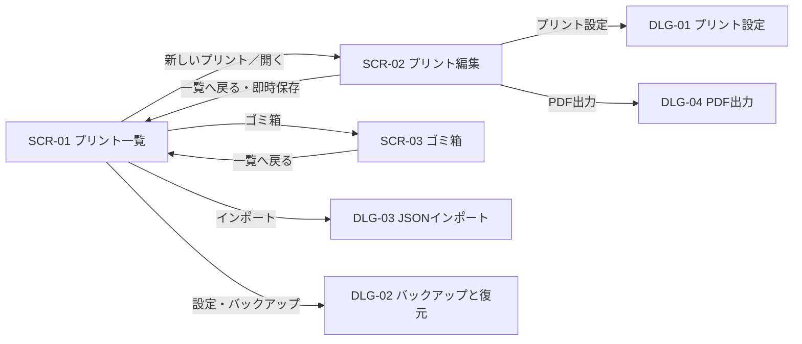

# 数学プリント作成ソフト 画面設計書（ワイヤーフレーム） v1.0

## 1. 文書情報

| 項目 | 内容 |
|---|---|
| 文書名 | 数学プリント作成ソフト 画面設計書（ワイヤーフレーム） |
| バージョン | 1.0 |
| 元文書 | 要件定義書.md v1.0 |
| 対象 | 中学校数学・PC向けWebアプリケーション |
| 目的 | MVPで必要な画面、遷移、操作、表示状態を定義する |

## 2. 設計方針

- PCブラウザでの利用を前提とし、基準表示幅を1440px、最小表示幅を1024pxとする。
- プリント編集は「左：編集」「右：ページプレビュー」の2ペインで行う。
- 編集中の題名、問題、解答、用紙設定は、可能な限り画面遷移せずその場で変更できるようにする。
- 自動保存を基本とし、保存操作をユーザーへ要求しない。保存状態は常に確認できるようにする。
- 生徒用・教師用の内容は同じ編集画面で管理し、プレビューモードで出力結果を切り替える。
- 破壊的操作には確認を設ける。ただし、復元可能な「ゴミ箱へ移動」は簡潔な確認とする。
- 初期バージョンではスマートフォン編集に対応しない。画面幅が最小幅未満の場合は利用案内を表示する。

## 3. 画面構成一覧

### 3.1 主要画面

| 画面ID | 画面名 | 目的 |
|---|---|---|
| SCR-01 | プリント一覧 | 新規作成、検索、既存プリントの管理を行う |
| SCR-02 | プリント編集 | 問題を編集し、印刷結果をリアルタイムに確認する |
| SCR-03 | ゴミ箱 | 削除済みプリントの復元・完全削除を行う |

### 3.2 ダイアログ・パネル

| UI ID | 名称 | 形式 | 主な起点 |
|---|---|---|---|
| DLG-01 | プリント設定 | モーダル | 編集画面の「プリント設定」 |
| DLG-02 | バックアップと復元 | モーダル | 一覧画面の「設定・バックアップ」 |
| DLG-03 | JSONインポート | モーダル | 一覧画面の「インポート」またはDLG-02 |
| DLG-04 | PDF出力 | モーダル | 編集画面の「PDF出力」 |
| DLG-05 | 確認 | モーダル | ゴミ箱移動、完全削除、ゴミ箱を空にする |
| PNL-01 | コンテンツ追加 | ポップオーバー | 問題ブロックの「＋ 内容を追加」 |
| PNL-02 | 数式パレット | ポップオーバー／フローティングパネル | リッチテキストツールバー |
| PNL-03 | 画像挿入・設定 | モーダル | リッチテキスト／追加メニュー |
| PNL-04 | 表挿入 | モーダル | リッチテキスト／追加メニュー |
| PNL-05 | 問題設定 | ポップオーバー | 問題ブロックの操作メニュー |
| PNL-06 | 解答欄設定 | インライン設定 | 問題／小問の解答欄 |
| PNL-07 | 囲み枠設定 | インライン設定 | 囲み枠コンテンツ |

## 4. 画面遷移



### 4.1 遷移時の保存

- 編集画面から一覧へ戻るときは、未保存変更をIndexedDBへ即時保存してから遷移する。
- ブラウザ離脱時に未保存変更がある場合も保存を試行する。
- 保存中に一覧へ戻る操作が行われた場合は「保存中…」を表示し、完了後に遷移する。
- 保存失敗時は遷移せず、エラーと再試行操作を表示する。

## 5. 共通UI仕様

### 5.1 ヘッダー

- 高さは64pxとする。
- 画面名または編集中のプリント題名、主要操作を表示する。
- 主要操作は右側、戻る操作は左側に配置する。
- 編集画面では保存状態を題名付近に表示する。

### 5.2 ボタン階層

| 種別 | 用途 | 例 |
|---|---|---|
| プライマリ | 画面の主要操作 | 新しいプリント、PDFをダウンロード |
| セカンダリ | 補助操作 | インポート、プリント設定 |
| テキスト／アイコン | 頻繁な軽操作 | 元に戻す、複製、閉じる |
| 危険 | 完全削除など復元不能な操作 | 完全に削除、ゴミ箱を空にする |

### 5.3 フィードバック

- 自動保存状態：`変更あり` → `保存中…` → `保存済み` の順で表示する。
- 完了通知は画面右下のトーストで表示し、数秒後に消える。
- エラー通知は自動で消さず、再試行または詳細確認を可能にする。
- Undoで戻せる操作は、必要に応じてトースト内にも「元に戻す」を表示する。

### 5.4 モーダル

- 背景操作を禁止し、Escキーまたは右上の閉じるボタンで閉じられるようにする。
- 「適用」で確定する設定画面は、キャンセル、Esc、閉じるボタンで確認を出さず変更途中の内容を破棄する。即時反映型のパネルは変更を維持して閉じる。
- 危険な操作の実行ボタンは右下に配置し、通常操作と色・文言で区別する。

### 5.5 キーボードとフォーカス

- Tabキーで視覚上の順序どおりに移動できるようにする。
- フォーカス位置を常に視認できるようにする。
- ドラッグ操作を実装する場合は、同等のキーボード操作を必ず用意する。
- モーダル表示中はフォーカスをモーダル内に閉じ、閉じた後は起点へ戻す。

## 6. SCR-01 プリント一覧

### 6.1 目的

保存されているプリントを更新日時順で確認し、新規作成、検索、複製、バックアップ、削除を行う。

### 6.2 ワイヤーフレーム

```text
┌──────────────────────────────────────────────────────────────────────────────┐
│ 数学プリント作成                                      [設定・バックアップ] │
├──────────────────────────────────────────────────────────────────────────────┤
│                                                                              │
│  プリント                                                     [＋ 新しいプリント]│
│                                                                              │
│  [🔍 題名で検索________________________________]  [インポート]  [ゴミ箱 (3)] │
│                                                                              │
│  最近のプリント                                        更新日時の新しい順   │
│  ┌────────────────────────────────────────────────────────────────────────┐  │
│  │ 一次方程式 練習問題                     JIS B5    2026/08/09 09:42 [⋮] │  │
│  ├────────────────────────────────────────────────────────────────────────┤  │
│  │ 比例と反比例                              A4    2026/08/08 16:20 [⋮] │  │
│  ├────────────────────────────────────────────────────────────────────────┤  │
│  │ 無題のプリント                        JIS B5    2026/08/07 11:05 [⋮] │  │
│  └────────────────────────────────────────────────────────────────────────┘  │
│                                                                              │
└──────────────────────────────────────────────────────────────────────────────┘

[⋮] メニュー
┌────────────────────┐
│ 開く               │
│ 複製               │
│ JSONエクスポート   │
│ ────────────────── │
│ ゴミ箱へ移動       │
└────────────────────┘
```

### 6.3 表示項目

| 項目 | 仕様 |
|---|---|
| 題名 | 1行表示。長い場合は末尾を省略し、ホバーで全文を表示する |
| 用紙サイズ | `JIS B5` または `A4` を表示する |
| 更新日時 | 当日は時刻まで、過去日は年月日と時刻を表示する |
| 操作メニュー | 開く、複製、JSONエクスポート、ゴミ箱へ移動 |
| ゴミ箱件数 | 1件以上ある場合に件数を表示する |

### 6.4 操作仕様

- 「新しいプリント」を押すと初期値のプリントを作成し、SCR-02へ直接遷移する。設定画面は挟まない。
- 新規プリントの初期値は、題名「無題のプリント」、JIS B5、縦、標準余白15mm、BIZ UDPゴシックとする。
- 行の題名部分または「開く」でSCR-02へ遷移する。
- 検索は題名のみを対象とし、入力に応じて一覧を絞り込む。
- 検索文字列の前後空白は無視し、大文字・小文字および全角・半角の差は可能な範囲で吸収する。
- 複製時はすべての識別子を再生成し、題名を「元の題名のコピー」とする。完了後は一覧先頭へ追加する。
- JSONエクスポートは対象プリントを1ファイルとしてダウンロードする。
- ゴミ箱へ移動後は一覧から除外し、「ゴミ箱へ移動しました」と「元に戻す」を表示する。

### 6.5 状態別表示

#### プリントがない場合

```text
┌──────────────────────────────────────────────┐
│              まだプリントがありません       │
│  新しいプリントを作成するか、JSONから        │
│  インポートしてください。                    │
│                                              │
│       [＋ 新しいプリント] [インポート]       │
└──────────────────────────────────────────────┘
```

#### 検索結果がない場合

- 「『検索語』に一致するプリントはありません」と表示する。
- 「検索をクリア」を表示する。

#### 読み込み失敗時

- 一覧領域にエラー内容と「再読み込み」を表示する。
- バックアップ機能への導線を維持する。

## 7. SCR-02 プリント編集

### 7.1 目的

プリントの内容をブロック単位で編集し、同時に最終PDF相当のページ組版を確認する。

### 7.2 全体ワイヤーフレーム

```text
┌──────────────────────────────────────────────────────────────────────────────────────────────┐
│ [← 一覧] [無題のプリント________________] 保存済み  [↶] [↷] [プリント設定] [PDF出力 ▼] │
├───────────────────────────────────────────────┬─┬────────────────────────────────────────────┤
│ 編集                                          │⋮│ プレビュー   [問題のみ ▼] [-] 100% [+]    │
│                                               │⋮│              [幅に合わせる] [ページ全体]  │
│ ┌───────────────────────────────────────────┐ │⋮├────────────────────────────────────────────┤
│ │ ⋮⋮  問題 1                    [複製] [⋮] │ │⋮│                                            │
│ │ ┌───────────────────────────────────────┐ │ │⋮│       ┌────────────────────────────┐       │
│ │ │ [サイズ▼][B][U][I][左][中][右]      │ │ │⋮│       │ 一次方程式 練習問題          │       │
│ │ │ [箇条書き][番号][数式][画像][表]     │ │ │⋮│       │ 年  組  番  名前__________    │       │
│ │ ├───────────────────────────────────────┤ │ │⋮│       │                            │       │
│ │ │ 次の方程式を解きなさい。              │ │ │⋮│       │ 1 次の方程式を解きなさい。 │       │
│ │ │                                       │ │ │⋮│       │   (1) 2x + 3 = 9          │       │
│ │ └───────────────────────────────────────┘ │ │⋮│       │       ____________         │       │
│ │                                           │ │⋮│       │   (2) 3x - 4 = 11         │       │
│ │ 小問                                      │ │⋮│       │       ____________         │       │
│ │ ┌───────────────┐ ┌───────────────┐       │ │⋮│       │                            │       │
│ │ │ (1) [半幅▼] ⋮ │ │ (2) [半幅▼] ⋮ │       │ │⋮│       │                            │       │
│ │ │ 2x + 3 = 9    │ │ 3x - 4 = 11   │       │ │⋮│       └────────────────────────────┘       │
│ │ │ 解答欄: 横線1行│ │ 解答欄: 横線1行│       │ │⋮│                                            │
│ │ └───────────────┘ └───────────────┘       │ │⋮│                  1 / 1                     │
│ │ [+ 小問を追加]                            │ │⋮│                                            │
│ │                                           │ │⋮│                                            │
│ │ [▶ 教師用の正解・解説]                    │ │⋮│                                            │
│ │ [+ 内容を追加]                            │ │⋮│                                            │
│ └───────────────────────────────────────────┘ │⋮│                                            │
│                                               │⋮│                                            │
│                 [＋ 問題を追加]               │⋮│                                            │
└───────────────────────────────────────────────┴─┴────────────────────────────────────────────┘
                         ↑ 左右へドラッグしてペイン幅を変更
```

### 7.3 レイアウト

- ヘッダーを除く画面高を編集領域とし、左右ペインはそれぞれ独立して縦スクロールする。
- 編集ペインをスクロールすると、同じ問題・例題の先頭位置を基準にプレビューが追従する。プレビュー側だけを手動スクロールすることもできる。
- 初期比率は50% / 50%とする。
- 区切り線のドラッグにより、おおむね35% / 65%から65% / 35%の範囲で変更できるようにする。
- 区切り線にはドラッグ可能であることが分かるハンドルを表示する。
- 変更したペイン比率は端末内に保持し、次回編集時にも適用する。
- プレビュー上部の操作バーは、プレビューをスクロールしても上部に固定する。

### 7.4 編集画面ヘッダー

| 要素 | 仕様 |
|---|---|
| 一覧へ戻る | 未保存内容を即時保存した後、SCR-01へ戻る |
| 題名 | クリックまたはTabで直接編集。空欄で確定した場合は「無題のプリント」とする |
| 保存状態 | 変更あり、保存中、保存済み、保存失敗を表示する |
| Undo / Redo | 実行できないときは無効表示。ショートカットにも対応する |
| プリント設定 | DLG-01を開く |
| PDF出力 | DLG-04を開き、現在のプレビュー表示モードを初期選択する |

### 7.5 問題ブロック

#### 構造

```text
┌──────────────────────────────────────────────────────────────┐
│ ⋮⋮  問題 3 / 番号なし / 問題 1から再開       [複製] [⋮] │ ← ブロックヘッダー
├──────────────────────────────────────────────────────────────┤
│ 本文・囲み枠・小問・解答欄・スペーサー・改ページ            │ ← コンテンツ列
├──────────────────────────────────────────────────────────────┤
│ [▶ 教師用の正解・解説]                                      │ ← 折りたたみ領域
│ [+ 内容を追加]                                               │
└──────────────────────────────────────────────────────────────┘
```

- 選択中の問題ブロックは枠線と薄い背景で明示する。
- ブロック内をクリックすると、その問題を選択状態にする。
- 「問題を追加」は選択中ブロックの直後に挿入し、新しい問題を選択する。未選択時は末尾に追加する。
- 問題番号は自動計算した結果をヘッダーに表示する。
- 番号なし、途中から振り直しの状態はヘッダーへ短いラベルで表示する。
- グリップアイコンは装飾表示とし、並べ替えは問題操作メニューの「上へ移動」「下へ移動」で行う。
- 削除はUndo可能とし、削除直後に「問題を削除しました」「元に戻す」を表示する。

#### 問題操作メニュー PNL-05

```text
┌──────────────────────────────┐
│ 問題を複製                  │
│ 上へ移動                     │
│ 下へ移動                     │
│ ─────────────────────────── │
│ ☑ 問題番号を付ける          │
│ □ この問題から振り直す      │
│   開始番号 [1____]           │
│ ─────────────────────────── │
│ 問題を削除                  │
└──────────────────────────────┘
```

- 「開始番号」は「この問題から振り直す」が有効な場合のみ操作可能とする。
- 開始番号は1以上の整数とし、不正値はその場でエラー表示する。

### 7.6 リッチテキストエディタ

```text
┌──────────────────────────────────────────────────────────────┐
│ [サイズ:標準▼] [B] [U] [I] │ [左][中][右] │ [・][1.]      │
│ [数式] [画像] [表]                                        │
├──────────────────────────────────────────────────────────────┤
│ ここに問題文を入力…                                        │
└──────────────────────────────────────────────────────────────┘
```

- ツールバーは「文字」「段落」「挿入」のまとまりで区切る。
- 問題本文、囲み枠、小問本文、教師用正解・解説のすべてで数式・画像・表の挿入ボタンを表示し、現在の編集欄内へ挿入する。
- 表セルでは数式と画像の挿入ボタンを表示し、表ボタンは表示しない。表セル内へ表を貼り付けた場合も入れ子にはせず、許可された文字・数式・画像だけを保持する。
- 文字サイズは小9pt・標準11pt・大14pt・特大18ptの4段階のみとする。
- 文字サイズは選択した文字と数式へ適用し、同じ編集欄内で混在できる。選択範囲に文字と数式の両方がある場合は双方へ同じサイズを適用する。
- 選択範囲内のサイズが1種類ならその値を表示し、複数なら「混在」と表示する。選択がない場合は現在の入力サイズを表示し、変更後に入力する文字へ適用する。
- 標準11ptを選択した文字はサイズマークを解除し、数式は標準の意味値へ更新する。
- Ctrl + B、Ctrl + U、Ctrl + Iを使用できるようにする。
- Ctrl + Z、Ctrl + Y、Ctrl + Shift + Zおよび通常のコピー、切り取り、貼り付け、全選択に対応する。
- 貼り付け時は許可された構造だけを保持し、外部フォント、色、背景、行間、CSS等は除去する。
- 数式は画面上で編集し、LaTeXコードの直接入力を主操作にしない。
- 独立数式はページ間で分割しない。現在ページに収まらなければ次ページへ移動し、空ページにも収まらなければ縦横比を維持して自動縮小する。自動縮小時は数式の編集UIへ情報表示する。
- 行内数式は途中で改行せず、残り行幅に収まらなければ次行へ送る。本文幅より広い場合は縦横比を維持して本文幅まで自動縮小する。
- エディタが狭い場合は低頻度の挿入操作を「その他」にまとめ、本文幅を確保する。

### 7.7 コンテンツ追加 PNL-01

```text
┌────────────────────────┐
│ 追加する内容           │
│ [本文]      [囲み枠]   │
│ [小問]      [解答欄]   │
│ [画像]      [表]       │
│ [スペーサー][改ページ] │
└────────────────────────┘
```

- 問題ブロック内の「＋ 内容を追加」から開く。
- 選択中コンテンツがある場合は直後、ない場合は末尾に追加する。
- 「画像」「表」は問題直下の独立したImageBlock、TableBlockを追加する。各WYSIWYGツールバーの「画像」「表」は現在の文書内へImageRef、RichTableとして挿入する。
- 追加後は新しいコンテンツへスクロールしてフォーカスする。

### 7.8 小問グループ

```text
┌──────────────────────────────────────────────────────────────┐
│ 小問                                                         │
│ ┌────────────────────────┐ ┌────────────────────────┐        │
│ │ ⋮⋮ (1)  幅 [半幅▼] [⋮]│ │ ⋮⋮ (2)  幅 [半幅▼] [⋮]│        │
│ │ [小問本文エディタ]     │ │ [小問本文エディタ]     │        │
│ │ 解答欄 [横罫線・1行▼] │ │ 解答欄 [横罫線・1行▼] │        │
│ │ [▶ 教師用正解]         │ │ [▶ 教師用正解]         │        │
│ └────────────────────────┘ └────────────────────────┘        │
│ ┌──────────────────────────────────────────────────────────┐ │
│ │ ⋮⋮ (3)  幅 [全幅▼] [⋮]                                  │ │
│ │ [小問本文エディタ]                                       │ │
│ └──────────────────────────────────────────────────────────┘ │
│ [＋ 小問を追加]                                             │
└──────────────────────────────────────────────────────────────┘
```

- 小問番号は表示順で自動採番する。
- 各小問のメニューで「この小問から番号を振り直す」を有効化し、1以上の開始番号を指定できる。指定した番号は後続の小問にも連続して反映する。
- 振り直しが有効な小問には「nから再開」の状態ラベルを表示する。
- 半幅は1行に2件、全幅は1行を占有する。半幅と全幅を同一グループで混在可能とする。
- 小問メニューは複製、上へ移動、下へ移動、削除を提供する。
- 小問と小問用解答欄は編集UI上でも1つのカードとして扱う。
- 小問本文と解答欄の組が現在ページに収まらなければ次ページへ移動する。空ページにも収まらない場合だけ本文を段落・行境界で分割し、小問番号は最初の断片だけに表示する。
- 解答欄は最後の本文断片の後へ置く。複数行ならページの行境界で分割し、同じページに1行も収まらない場合は次ページから開始する。
- 連続する半幅小問2件は一緒に同じページから開始する。空ページにも収まらない場合は左右の列位置を維持して独立に分割し、片側が先に終了した続きページではその列を空欄にする。後続小問を空いた列へ詰めない。

### 7.9 解答欄 PNL-06

```text
┌──────────────────────────────────────────────────┐
│ 生徒用解答欄                                     │
│ 種類  (●) 横罫線  ( ) 四角囲み                  │
│ 高さ  [ 3 ▼] 行                                  │
│                         [削除]                    │
└──────────────────────────────────────────────────┘
```

- 解答欄の行数は1～20とし、UI操作とJSON読込みに同じ上限を適用する。
- 横罫線では指定行数と同じ本数の線をプレビューに表示する。
- 問題全体用と小問用で同一UIを使用する。
- 問題全体用・小問用とも、複数行の解答欄は行境界でページ分割する。四角囲みを分割した場合は各ページ断片を独立した枠として表示する。

### 7.10 教師用正解・解説

```text
┌──────────────────────────────────────────────────────────────┐
│ [▼ 教師用の正解・解説]                                     │
│ 正解・解説                                                   │
│ ┌──────────────────────────────────────────────────────────┐ │
│ │ 本文と同じツールバー                                    │ │
│ ├──────────────────────────────────────────────────────────┤ │
│ │ x = 3                                                   │ │
│ │ 両辺から3を引いて…                                     │ │
│ └──────────────────────────────────────────────────────────┘ │
└──────────────────────────────────────────────────────────────┘
```

- 初期状態は折りたたみとし、入力済みの場合は「入力済み」ラベルを表示する。
- 問題単位では正解と解説を同じリッチテキスト領域に入力する。
- 小問単位の領域名は「教師用正解」とする。
- 正解・解説用ツールバーでは、本文の全機能に加えてスペーサーを挿入できるようにする。
- 問題のみモードではプレビューに表示しない。

### 7.11 囲み枠 PNL-07

```text
┌──────────────────────────────────────────────────────────────┐
│ 囲み枠  題名 [ポイント____________]  デザイン [帯見出し▼] [⋮]│
├──────────────────────────────────────────────────────────────┤
│ [リッチテキストエディタ]                                   │
└──────────────────────────────────────────────────────────────┘
```

- デザインはシンプル、見出し付き、帯見出し、強調のプリセットから選ぶ。
- 自由な枠線・色の設定は提供しない。
- 題名入力欄は4種類すべてで表示し、空欄を許可する。空白文字だけで確定した場合は空欄へ戻す。
- 題名が空欄の場合、プレビューとPDFでは題名文字、題名用の見出し・帯、題名領域の高さと余白を表示せず、枠内本文を先頭から表示する。
- 囲み枠全体が現在ページに収まらない場合は次ページへ移動する。空ページにも収まらない場合だけ、本文と同じ段落・行境界で分割する。
- 分割後は各ページへ枠線を表示する。題名がある場合だけ題名と見出し装飾を最初のページへ表示し、続きのページでは再表示しない。

### 7.12 スペーサーと改ページ

```text
┌──────────────────────────────────────────────────────────────┐
│ スペーサー       高さ [ 2 ▼] 行                       [削除]│
└──────────────────────────────────────────────────────────────┘

─────────────── ✂ ここで改ページ ──────────────────── [削除]
```

- スペーサーはEnter連打と区別できる専用コンテンツとして表示する。
- スペーサーはページ間で分割せず、残り領域に収まらない場合は全体を次ページ先頭へ移動する。
- 改ページは編集画面上で破線とラベルを使って明示する。
- 改ページ以降がプレビューの次ページ先頭に移ることを即時確認できるようにする。

### 7.13 プレビュー

#### 操作バー

| 要素 | 仕様 |
|---|---|
| モード | 問題のみ、解答付きから選択する |
| 縮小／拡大 | 25%刻みで変更する。下限25%、上限200% |
| 倍率 | 現在倍率をパーセント表示し、25～200%を25%刻みで直接選択可能。初期値100% |
| 幅に合わせる | ページ幅をプレビューペイン内に収める |
| ページ全体 | 1ページ全体をプレビューペイン内に収める |

#### 表示仕様

- PDFと同じ用紙比率、余白、フォント、改ページ規則を使用する。
- HTMLプレビューとPDFはピクセル単位の一致を要求せず、各文章・数式ブロックで概ね1行以内の折り返し差を許容する。問題の開始ページ、明示改ページ、内容順序は一致させ、欠落・重なり・はみ出しは許容しない。
- ページは薄いグレーの背景上に白い紙として表示し、ページ間に間隔を設ける。
- 各プレビューページの下に現在ページと総ページ数をUIとして表示するが、紙面にはページ番号を印字しない。
- 通常ヘッダーは各出力セクションの1ページ目だけに表示し、2ページ目以降には簡易ヘッダーも表示しない。
- 文字入力は編集領域へ即時反映し、右側プレビューは最後の変更から50msのdebounce後に差分更新を開始する。
- 再組版中も直前のプレビューを維持し、操作バー付近に小さく「更新中…」を表示する。
- 問題ブロック、小問＋解答欄は要件の分割優先順位に従って配置する。
- 長い本文は段落・リスト項目・独立数式の境界を優先し、1つの段落またはリスト項目だけで1ページを超える場合は表示行の境界で分割する。
- 問題が複数ページへ分割された場合、問題番号は最初のページだけに表示し、続きページでは番号欄を空けたまま本文の字下げを維持する。

#### プレビューモードの差

| 内容 | 問題のみ | 解答付き |
|---|:---:|:---:|
| 問題・小問 | 表示 | 表示 |
| 生徒用解答欄 | 表示 | 非表示 |
| 教師用正解・解説 | 非表示 | 問題直後に表示 |
| 赤字の「解答」見出し | 非表示 | 表示 |

- 赤い「解答」見出しは、正解・解説の最初の1表示行または最初の分割不能ブロックと同じページへ配置する。見出しだけがページ末尾に残る場合は両方を次ページへ送る。
- 問題および配下の小問に表示可能な教師用正解・解説がない場合は、赤い「解答」見出しを表示しない。

#### 組版エラー

- 画像はページ間で分割せず、印刷可能領域の高さを超える場合は縦横比を維持して1ページ内へ自動縮小する。自動縮小時は、該当画像の編集UIへ「ページに収めるため自動縮小」と情報表示する。
- 表はページ間で分割せず、現在ページに収まらなければ次ページへ移動する。空のページにも収まらない場合は表全体を同率縮小し、該当表の編集UIへ「ページに収めるため表全体を自動縮小」と情報表示する。
- 定義済みの次ページ移動・内部分割・自動縮小を適用しても測定誤差などで印刷可能領域を超える場合は、該当ページと編集側コンテンツの双方に警告を表示する。
- レンダリングに失敗した場合はプレビュー領域に「プレビューを更新できませんでした」と「再試行」を表示し、編集内容は失わない。

### 7.14 内容が空の最後の問題

```text
編集ペイン                                プレビューペイン
┌─────────────────────────────┐           ┌──────────────────────────┐
│ 問題 1                      │           │ 無題のプリント           │
│ 問題1には内容がありません。 │           │ 年 組 番 名前__________  │
│                             │           │                          │
│ [＋ 内容を追加]             │           │ 1                        │
└─────────────────────────────┘           └──────────────────────────┘
```

- Worksheetは常に1問以上を持ち、最後の1問は削除できない。
- 最後の1問からすべてのContentBlockを削除した場合は上記状態を表示し、「内容を追加」から編集を再開できるようにする。
- 新規プリントは空の本文を1件含み、初期入力サイズを標準11ptとするため、作成直後は本文エディタへ直接入力できる。

## 8. DLG-01 プリント設定

### 8.1 ワイヤーフレーム

```text
┌──────────────────────────────────────────────────────┐
│ プリント設定                                    [×] │
├──────────────────────────────────────────────────────┤
│ 用紙                                                 │
│   サイズ       (●) JIS B5   ( ) A4                  │
│   向き          縦（固定）                           │
│   余白         [標準（15mm） ▼]                      │
│                                                      │
│ フォント                                             │
│   日本語フォント [BIZ UDPゴシック ▼]                 │
│                                                      │
│ ヘッダー                                             │
│   表示項目 [✓ 年] [✓ 組] [✓ 番] [✓ 名前]             │
│   各項目は個別に表示・非表示を選択可能               │
│   各出力セクションの1ページ目に題名と                │ 
│   選択した項目を表示                                 │
│   2ページ目以降はヘッダーなし                        │
│                                                      │
│ 問題番号                                             │
│   表示形式      [1. ▼]                               │
│                                                      │
│                             [キャンセル] [適用]      │
└──────────────────────────────────────────────────────┘
```

### 8.2 設定項目

| 分類 | 項目 | 値 |
|---|---|---|
| 用紙 | サイズ | JIS B5（182×257mm）/ A4（210×297mm） |
| 用紙 | 向き | 縦のみ。変更不可であることを明示する |
| 用紙 | 余白 | 広い20mm / 標準15mm / 狭い10mm / かなり狭い5mm。A4とJIS B5で共通 |
| フォント | 日本語フォント | BIZ UDPゴシック、BIZ UDゴシック、BIZ UDP明朝、Noto Sans JP、Noto Serif JP。初期値はBIZ UDPゴシック |
| ヘッダー | 表示内容 | 題名は常に表示。年、組、番、名前は項目ごとに表示・非表示を選択可能。初期値はすべて表示 |
| 問題番号 | 表示形式 | 1 / 1. / 1) / (1) / [1] / 問1 |

- 変更内容は「適用」で編集データへ反映し、Undo対象にする。
- 適用後はプレビューを再組版する。
- 題名は常に表示する。年、組、番、名前は個別の表示・非表示設定を設ける。
- 数式用フォントは本文用フォントと内部的に分離するが、MVPではユーザー設定項目にしない。

## 9. PNL-02 数式パレット

### 9.1 ワイヤーフレーム

```text
┌──────────────────────────────────────────────────────────────┐
│ 数式を入力                                             [×]  │
├──────────────────────────────────────────────────────────────┤
│ [基本] [分数・指数] [平方根] [不等号] [括弧] [図形] [その他]│
│                                                              │
│ [＋] [－] [×] [÷] [＝] [≠] [±]                             │
│                                                              │
│ 数式プレビュー                                               │
│ ┌──────────────────────────────────────────────────────────┐ │
│ │                       2x + 3 = 9                         │ │
│ └──────────────────────────────────────────────────────────┘ │
│                                                              │
│                [行内数式] [独立数式]          [挿入／更新]   │
└──────────────────────────────────────────────────────────────┘
```

- 現在のカーソル位置へ挿入する。既存数式から開いた場合は「更新」と表示する。
- 数式は視覚的に直接編集できるようにし、LaTeXソースは通常操作では表示しない。
- パレットに「最近使った」「よく使う」は設けない。
- 分類と記号は要件定義書の数式パレット項目を満たす。

## 10. PNL-03 画像挿入・設定

```text
┌──────────────────────────────────────────────────────┐
│ 画像を挿入                                      [×] │
├──────────────────────────────────────────────────────┤
│ [ファイルを選択] またはここへドロップ                │
│ PNG / JPEG / WebP                                    │
│                                                      │
│ プレビュー     ┌──────────────────┐                  │
│                │                  │                  │
│                └──────────────────┘                  │
│                                                      │
│ 配置  (●) 独立  ( ) 左回り込み  ( ) 右回り込み      │
│ サイズ [50% ▼]                                      │
│ 代替テキスト [____________________________]          │
│                                                      │
│                             [キャンセル] [挿入]      │
└──────────────────────────────────────────────────────┘
```

- サイズは25%、33%、50%、66%、75%、100%のプリセットとする。
- 幅の割合は挿入先の内側幅を基準とする。本文は本文幅、囲み枠は枠内本文幅、小問は小問列幅、表セルはセル内側幅を100%とする。
- 独立配置では6種類すべてを選択できる。左・右回り込みでは25%、33%、50%だけを選択でき、66%、75%、100%は無効表示して「回り込みでは50%以下を選択してください」と補足する。
- 幅プリセット適用後の高さが印刷可能領域を超える画像は、縦横比を維持して1ページ内へ自動縮小することを補足表示する。
- 左・右回り込みは画像があるページ内だけに適用し、次ページの本文は通常幅へ戻ることを補足表示する。
- SVGはMVPでは非対応とし、ファイル拡張子や申告MIME型にかかわらず挿入しない。
- 画像は1点10MiB以下、同一プリント内の画像合計50MiB以下、幅・高さ各10,000px以下、総画素数40MP以下とする。
- ファイル形式不正、容量超過、読み込み失敗をファイル欄の直下へ表示する。
- 挿入後の画像選択時にも同じ設定UIを使用し、配置とサイズを変更できるようにする。

## 11. PNL-04 表挿入・編集

### 11.1 挿入

```text
┌──────────────────────────────────────────────────────┐
│ 表を挿入                                        [×] │
├──────────────────────────────────────────────────────┤
│ テンプレート                                         │
│ (●) 一般   ( ) 関数   ( ) 度数分布                  │
│                                                      │
│ 一般表のサイズ                                       │
│ 行数（1～20）[3__]   列数（1～20）[4__]              │
│                                                      │
│ プレビュー                                           │
│ ┌──────┬──────┬──────┬──────┐                       │
│ │      │      │      │      │                       │
│ ├──────┼──────┼──────┼──────┤                       │
│ │      │      │      │      │                       │
│ └──────┴──────┴──────┴──────┘                       │
│                                                      │
│                             [キャンセル] [挿入]      │
└──────────────────────────────────────────────────────┘
```

- 一般は行数・列数を1～20の範囲で指定する。作成後の行列追加、貼り付け、JSON読込みにも最大20行×20列を適用する。
- 関数はx、yの見出しを持つ初期表を生成する。
- 度数分布は階級、度数の見出しを持つ初期表を生成する。
- テンプレート適用後はすべて通常の表として編集する。
- 表はページ間で分割しない。空の新しいページにも収まらない場合は、文字や罫線を含む表全体を同率縮小して1ページ内へ収める。
- 表セル内画像は画像単独で改ページせず、表全体の次ページ移動と自動縮小に従う。

### 11.2 表選択時のツールバー

```text
[行を上に追加] [行を下に追加] [行削除]
[列を左に追加] [列を右に追加] [列削除]
[横結合] [縦結合] [結合解除]
```

- 実行できない操作は無効表示にする。
- 背景色変更は提供しない。

## 12. DLG-04 PDF出力

```text
┌──────────────────────────────────────────────────────┐
│ PDF出力                                         [×] │
├──────────────────────────────────────────────────────┤
│ 出力内容                                             │
│ (●) 問題のみ                                        │
│     生徒配布用。解答欄を含み、正解・解説は含まない。 │
│ ( ) 解答付き                                        │
│     問題の直後に正解・解説を表示する。               │
│ ( ) 問題＋解答                                      │
│     問題編の後、新しいページから解答編を出力する。   │
│                                                      │
│ 用紙: JIS B5 / 縦  ページ数: 3ページ（見込み）       │
│                                                      │
│                       [キャンセル] [PDFをダウンロード]│
└──────────────────────────────────────────────────────┘
```

- 初期選択は現在のプレビューモードと合わせる。
- 出力前に最新の編集状態を保存し、最新状態で再組版する。
- 生成中は進捗状態を表示し、重複実行を防ぐ。
- 成功時はPDFをダウンロードし、完了トーストを表示する。
- 失敗時はモーダルを閉じず、再試行できるようにする。

## 13. SCR-03 ゴミ箱

### 13.1 ワイヤーフレーム

```text
┌──────────────────────────────────────────────────────────────────────────────┐
│ [← プリント一覧]  ゴミ箱                                [ゴミ箱を空にする] │
├──────────────────────────────────────────────────────────────────────────────┤
│                                                                              │
│  削除したプリントは自動では削除されません。                                 │
│  ┌────────────────────────────────────────────────────────────────────────┐  │
│  │ 図形の証明         JIS B5   削除: 2026/08/08  [復元] [完全に削除]     │  │
│  ├────────────────────────────────────────────────────────────────────────┤  │
│  │ 資料の活用             A4   削除: 2026/08/01  [復元] [完全に削除]     │  │
│  └────────────────────────────────────────────────────────────────────────┘  │
│                                                                              │
└──────────────────────────────────────────────────────────────────────────────┘
```

### 13.2 操作仕様

- 復元すると削除日時を解除し、SCR-01の更新日時順に戻す。
- 完全削除はDLG-05で確認後に実行する。実行後はUndoできない。
- 「ゴミ箱を空にする」はゴミ箱が空の場合は無効表示する。
- 自動削除は行わない。

### 13.3 空状態

```text
┌──────────────────────────────────────────────┐
│             ゴミ箱は空です                  │
│       [プリント一覧へ戻る]                  │
└──────────────────────────────────────────────┘
```

## 14. DLG-02 バックアップと復元

```text
┌────────────────────────────────────────────────────────────┐
│ 設定・バックアップ                                   [×]  │
├────────────────────────────────────────────────────────────┤
│ すべてのプリントをバックアップ                           │
│ 通常一覧のプリントを1つのJSONに書き出します。             │
│ ゴミ箱内のプリントは含まれません。                         │
│                                      [全体をエクスポート] │
│                                                            │
│ バックアップから復元                                       │
│ 単一プリントまたは全体バックアップのJSONを読み込みます。   │
│                                              [インポート] │
│                                                            │
│ データについて                                             │
│ 保存先: このブラウザ内 / スキーマバージョン: 1             │
└────────────────────────────────────────────────────────────┘
```

- 全体エクスポートは通常一覧の全プリントと、それらから参照される画像を対象とする。ゴミ箱内のプリントと、その専用画像は含めない。
- バックアップJSONにはformatとversionを必ず含める。
- クラウド保存やアカウント機能がないことを短く説明する。

## 15. DLG-03 JSONインポート

### 15.1 ワイヤーフレーム

```text
┌──────────────────────────────────────────────────────┐
│ JSONインポート                                  [×] │
├──────────────────────────────────────────────────────┤
│ [JSONファイルを選択] またはここへドロップ            │
│                                                      │
│ ファイル: math-worksheet-backup.json                  │
│ 形式: math-worksheet / バージョン: 1                 │
│ 内容: プリント12件                                    │
│                                                      │
│ 既存のプリントは削除されず、追加で読み込まれます。   │
│ 同じ識別子があるデータには新しい識別子を割り当てます。│
│                                                      │
│                         [キャンセル] [インポート実行] │
└──────────────────────────────────────────────────────┘
```

### 15.2 処理と結果

- ファイル選択後、形式、スキーマバージョン、件数を事前検証して表示する。
- 不正なJSON、非対応形式、将来バージョン、必須項目不足は実行前にエラー表示する。
- 初期動作は既存データを消さない追加方式とする。
- 完了後は「○件をインポートしました」を表示し、一覧を更新する。
- 1件でも検証に失敗した場合は全件を保存せず、該当箇所と理由を表示する。全件が正常な場合だけ単一トランザクションで保存する。

## 16. DLG-05 確認ダイアログ

### 16.1 ゴミ箱へ移動

```text
┌──────────────────────────────────────────────┐
│ プリントをゴミ箱へ移動しますか？           │
│ 「一次方程式 練習問題」はゴミ箱から         │
│ 復元できます。                               │
│                   [キャンセル] [移動する]   │
└──────────────────────────────────────────────┘
```

### 16.2 完全削除

```text
┌──────────────────────────────────────────────┐
│ プリントを完全に削除しますか？             │
│ この操作は元に戻せません。                   │
│             [キャンセル] [完全に削除]       │
└──────────────────────────────────────────────┘
```

### 16.3 ゴミ箱を空にする

- 対象件数を本文に表示する。
- 「この操作は元に戻せません」と明示する。
- 実行ボタンは「○件を完全に削除」とする。

## 17. 画面幅・スクロール・レスポンシブ

| 条件 | 動作 |
|---|---|
| 1440px以上 | 2ペインを十分な幅で表示する |
| 1024～1439px | 2ペインを維持し、一部のツールをメニュー内にまとめる |
| 1024px未満 | 編集画面は表示せず、PCまたは広い画面での利用案内を表示する |

- 一覧・ゴミ箱は狭い画面で項目間隔を縮めてもよいが、MVPではスマートフォン最適化を行わない。
- 編集ペインとプレビューペインは独立スクロールとし、ページ全体の横スクロールは原則発生させない。
- モーダルが画面高を超える場合は、ヘッダーとフッターを固定して本文のみスクロールする。
- 編集操作後の自動保存はプレビュー更新とは別に、最後の変更から750msのdebounce後に開始する。

## 18. アクセシビリティ

- アイコンだけのボタンにはツールチップと読み上げ用ラベルを付ける。
- 色だけに依存せず、選択、エラー、保存状態を文字または形でも示す。
- 文字と背景、フォーカス枠は十分なコントラストを確保する。
- ドラッグ＆ドロップで可能な操作にはキーボード操作を必ず用意する。
- 入力エラーは対象項目の近くに表示し、読み上げでも通知する。
- リッチテキストエディタ、数式エディタ、表編集の現在位置と選択状態を支援技術へ伝える。

## 19. 主な確認メッセージ・エラーメッセージ

| 場面 | メッセージ例 | 操作 |
|---|---|---|
| 自動保存失敗 | 保存できませんでした。ブラウザの空き容量を確認してください。 | 再試行 |
| プレビュー失敗 | プレビューを更新できませんでした。編集内容は保存されています。 | 再試行 |
| PDF生成失敗 | PDFを生成できませんでした。 | 再試行 / 閉じる |
| JSON形式不正 | このファイルは数学プリントのバックアップとして読み込めません。 | 別のファイルを選択 |
| 非対応バージョン | このバックアップのバージョンには対応していません。 | 閉じる |
| 画像形式不正 | PNG、JPEG、WebPの画像を選択してください。 | 再選択 |
| 画面幅不足 | プリントの編集には横幅1024px以上の画面が必要です。 | 一覧へ戻る |

## 20. 要件との対応表

| 要件分野 | 対応する画面・UI |
|---|---|
| プリント一覧、新規作成、検索、複製 | SCR-01 |
| ゴミ箱、復元、完全削除 | SCR-03、DLG-05 |
| 2ペイン編集、題名編集、ペイン幅変更 | SCR-02 |
| 問題・小問の追加、複製、削除、並べ替え | SCR-02、PNL-05 |
| 採番なし、途中から採番 | PNL-05 |
| WYSIWYG、数式、画像、表 | SCR-02、PNL-02～04 |
| 囲み枠、解答欄、スペーサー、改ページ | SCR-02、PNL-01、PNL-06、PNL-07 |
| 教師用正解・解説 | SCR-02の折りたたみ領域 |
| 用紙、余白、フォント、ヘッダー、番号形式 | DLG-01 |
| リアルタイムプレビュー、ズーム、表示モード | SCR-02右ペイン |
| PDF 3モード | DLG-04 |
| JSON単体バックアップ | SCR-01のプリント操作メニュー |
| JSON全体バックアップ | DLG-02 |
| JSONインポート | DLG-03 |
| Undo / Redo、自動保存 | SCR-02ヘッダー、共通フィードバック |

## 21. MVP対象外として画面に設けない項目

- ユーザー登録、ログイン、アカウントメニュー
- クラウド同期、共同編集、共有リンク
- フォルダ、タグ、並べ替え条件の詳細設定
- ページ番号設定、ページ全体の段組み
- 自由な文字サイズ、文字色、背景色
- 表の背景色
- 数式パレットの履歴・お気に入り
- 本格的な作図・グラフ作成画面
